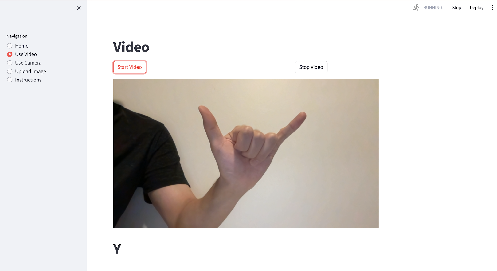
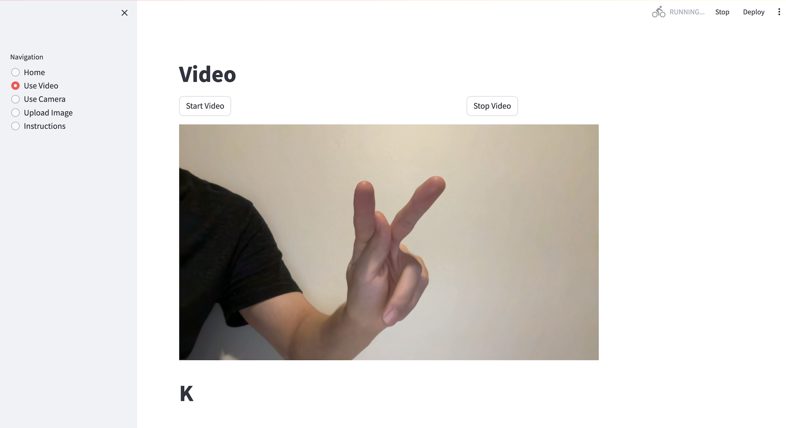
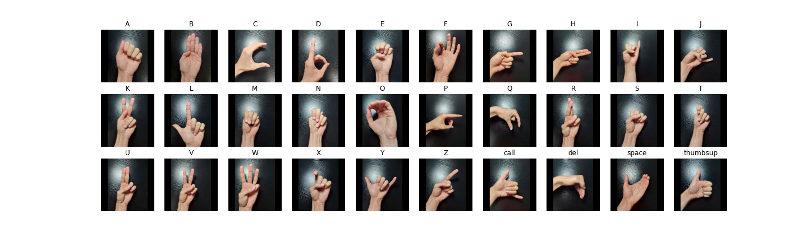
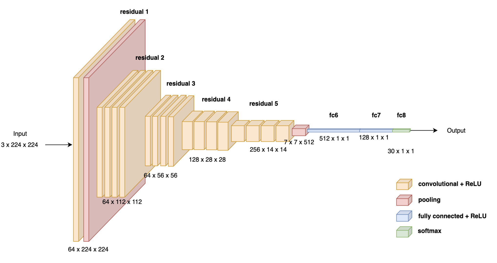

# American Sign Language (ASL) Detector
This model can recognize and translate ASL gestures. It was developed using Convolutional Neural Networks (CNNs) and achieved a test accuracy of 99.55%. The following image is an example of the model being used in real time to translate the ASL gesture.

  
  

# Classes
This model can classify a total of 30 unique classes, including letters from A to Z, as well as special inputs like space, delete, okay, and thumbs up.

# Data Collection
The data was collected from four different sources.
| Dataset | Total Images | Classes |
|----------|----------|----------|
| [American Sign Language 1](https://www.kaggle.com/datasets/kapillondhe/american-sign-language) | 166K | A to Z, Space |
| [American Sign Language 2](https://www.kaggle.com/datasets/debashishsau/aslamerican-sign-language-aplhabet-dataset)  | 223K | A to Z, Space, Delete |
| [American Sign Language 3](https://www.kaggle.com/datasets/grassknoted/asl-alphabet)  | 87K | A to Z, Space, Delete |
| [American Sign Language 3](https://www.kaggle.com/datasets/kapitanov/hagrid)  | 56K | Okay, Thumbs Up |

Then 2000 images were selected randomly for each of the 30 classes and took a greater proportion from datasets that display more diversity
| Classes | ASL 1 | ASL 2 | ASL 3 | HaGRID |
|----------|----------|----------|----------|----------|
| A to Z (each)| 200 | 200 | 1600 | 0 |
| Space | 200 | 200 | 1600 | 0 |
| Delete | 0 | 400 | 1600 | 0 |
| Okay | 0 | 0 | 0 | 2000 |
| Thumbs Up | 0 | 0 | 0 | 2000 |

Afterwards, the data was split into Training (80%), Validation (10%) and Test (10%).

# Data Augmentation
Images were augmented with a 15% probability using the following transformations:
- 15 degree rotations
- Scaling between 0.85 and 1.15
- Gaussian blurring of σ=0.1 to σ=2.0
- Horizontal flipping

# Model Architecture
The model that was used was a variation of the ResNet 18 which includes:
- 17 Convolution layers
- 2 custom Fully Connected layers
- Incorporated dropout
- Incorporates skip connections
- Average pooling

# Quantitative Results
Trained on 60,000 unique images and achieved an accuracy of 99.96% and a loss of 0.0010  
Validated on 6,000 unseen images and achieved an accuracy of 99.47% and a loss of 0.0017

# Qualitative Results
Tested on 6,000 unseen images and achieved an accuracy of 99.55%

# Installations
To install the necessary packages, please execute the following command:
- `pip install -r requirements.txt`

Once the installation is complete, you can start the website by running:
- `streamlit run app.py`
